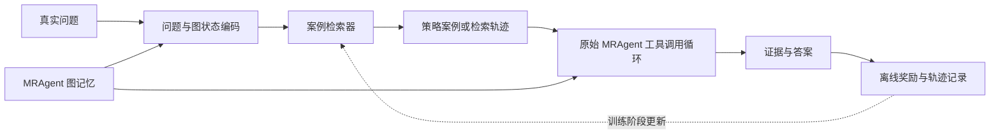

# MRAgent 可插拔 CBR / soft-Q 路径学习设想

更新时间：2026-07-15

## 1. 目标

模块不替换 MRAgent 图，也不直接生成答案。它只学习“面对某类问题和某种图状态，哪种检索策略或历史轨迹更可能找到证据”，然后把策略提示交给原始 tool-calling agent。



蓝图中的新增模块只有状态编码、案例检索和训练反馈；MRAgent 的图构建、工具和答案器保持可替换边界。

## 2. CBR 与 soft-Q 的区别

- **相似度 CBR**：按问题/图状态相似度返回历史成功策略。它是无学习或弱学习基线。
- **成功分类器**：学习一个 case 对当前问题是否有用，接近公开 Memento 代码中可验证的离线分类器路线。
- **soft-Q case selector**：把“选择哪个策略 case”视为动作，使用后续证据命中、成本和答案结果计算 TD 目标。它不是简单把分类器称为 Q-learning。
- **图动作 Q-learning**：直接学习下一次 tool call，动作空间更大、耦合更强，先不做。第一阶段只选择策略 case，保持模块通用。

## 3. Case 数据结构

每个 case 只存策略，不存 benchmark 答案或可复制事实：

```json
{
  "case_id": "...",
  "question_features": {"type": "temporal", "entities": 2, "relations": 1},
  "graph_features": {"seed_hits": 3, "tag_degree": 12, "topic_candidates": 4},
  "strategy": {
    "preferred_tools": ["事件关键词查询", "按标签扩展", "对话时间查询"],
    "stop_condition": "找到事件及其对话时间",
    "avoid": ["重复查询同一关键词"]
  },
  "trajectory_summary": ["命中事件", "补充时间锚点", "停止"],
  "cost": {"tool_calls": 3},
  "reward": {"evidence_hit": 1, "answer_correct": 1}
}
```

禁止存 gold answer、完整 gold evidence 文本或同一测试题的最终答案。

## 4. 检索前预训练设想

1. 在训练 conversation 已构建的图上采样目标节点或事件组合。
2. 让模型根据图内容生成典型问题，但不读取 benchmark QA。
3. 运行原始 MRAgent 或受限搜索，记录能到达已知目标节点的轨迹。
4. 将成功/失败轨迹压缩成策略 case，训练相似度、成功分类器或 soft-Q selector。
5. 冻结模块后，在未见 conversation 的真实 QA 上评估。

这个流程可用于不同图结构，只需 adapter 提供统一的 `state`、`available_tools`、`trajectory` 和 `reward` 接口。

## 5. 数据划分与防泄漏

- 正式结果使用 conversation-level split，训练、验证、测试 conversation 不重叠。
- 测试 QA 的 gold answer/evidence 不参与 case 生成、selector 更新或 early stopping。
- “probe-online” 只能用测试图中自行生成的问题和已知目标节点训练，不使用 benchmark QA；必须与严格冻结结果分表。
- case 检索返回策略，不返回答案事实；报告抽查最近邻 case 防止文本泄漏。

## 6. 实验序列

1. Full MRAgent：无案例模块。
2. + similarity CBR：只按相似度选策略。
3. + offline success classifier：学习 case 成功概率。
4. + frozen soft-Q selector：训练集学习，测试冻结。
5. + probe-online soft-Q：只用图生成问题在线更新，单独报告。

每组使用相同图、相同 QA 题、相同工具预算。核心指标除 F1/Judge/Evidence hit 外，还包括首次命中步数、无效工具比例、重复工具比例、总调用数和延迟。

## 7. 奖励草案

```text
reward = 1.0 * 新增 gold/目标证据命中
       + 0.5 * 最终语义正确
       - 0.02 * 每次工具调用
       - 0.10 * 重复或空结果调用
       - 0.20 * 超预算或执行失败
```

正式训练前必须分别做 reward ablation，防止模型只学“少调用工具”而不找证据。

## 8. 实施边界

当前提交只固定接口、数据和评估设计，不声称已经实现 Q-learning。进入实现前必须先由 500 题主实验和 200 题消融确认：主动搜索确有稳定增益，且 badcase 中“工具/路径失败、过早停止、重复调用”占有足够比例。否则路径学习不是首要改进方向。
