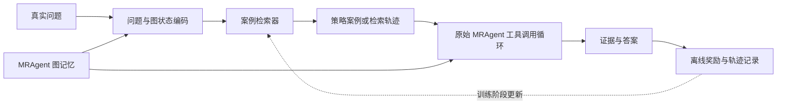

# MRAgent 可插拔 CBR / Q-learning 路径学习设想

更新时间：2026-07-20

## 1. 目标

模块不替换 MRAgent 图，也不直接生成答案。它只学习“面对某类问题和某种图状态，哪种检索策略或历史轨迹更可能找到证据”，然后把策略提示交给原始 tool-calling agent。



蓝图中的新增模块只有状态编码、案例检索和训练反馈；MRAgent 的图构建、工具和答案器保持可替换边界。

## 2. 当前决策：CBR 提供先验，Q-learning 排序图动作

- **相似度 CBR**：按问题类型和图状态返回历史成功路径摘要，用来提供优先工具、停止条件和应避免的路径。
- **return ranker**：用一条轨迹从当前步骤到结束的累计回报监督动作分数。它是必要基线，但没有 bootstrap target，不能称为 Q-learning。
- **离线 Q-learning**：学习 `Q(state, valid_action)`，使用 `r + gamma * max Q_target(next_state, next_valid_action)` 更新，直接重排下一步图工具和候选参数。
- **组合方式**：CBR 检索到的路径只作为状态特征或候选动作先验；Q-learning 决定当前状态下采用哪个合法动作。最终工具调用仍由 MRAgent ToolBridge 执行。

这一路线比只学习“选择哪个 case”更贴近现有证据：200 题消融已证明 active tool loop 有价值，当前 badcase 也直接暴露了无效 topic 参数、空结果、重复访问和路径偏离。首轮 Q-learning 因此聚焦检索路径，不修改图构建。

## 3. Case 数据结构

每个 case 只存策略，不存 benchmark 答案或可复制事实：

```json
{
  "case_id": "...",
  "question_features": {"type": "temporal", "entities": 2, "relations": 1},
  "graph_features": {"seed_hits": 3, "tag_degree": 12, "topic_candidates": 4},
  "strategy": {
    "preferred_tools": ["事件关键词查询", "按标签扩展", "对话时间查询"],
    "stop_condition": "找到事件及其对话时间",
    "avoid": ["重复查询同一关键词"]
  },
  "trajectory_summary": ["命中事件", "补充时间锚点", "停止"],
  "cost": {"tool_calls": 3},
  "reward": {"evidence_hit": 1, "answer_correct": 1}
}
```

禁止存 gold answer、完整 gold evidence 文本或同一测试题的最终答案。

## 4. 检索前预训练设想

1. 在训练 conversation 已构建的图上采样目标节点或事件组合。
2. 让模型根据图内容生成典型问题，但不读取 benchmark QA。
3. 运行原始 MRAgent 或受限搜索，记录能到达已知目标节点的轨迹。
4. 将成功/失败轨迹压缩成策略 case，训练相似度检索器、return ranker 或离线 Q 动作排序器。
5. 冻结模块后，在未见 conversation 的真实 QA 上评估。

这个流程可用于不同图结构，只需 adapter 提供统一的 `state`、`available_tools`、`trajectory` 和 `reward` 接口。

## 5. 数据划分与防泄漏

- 正式结果使用 conversation-level split，训练、验证、测试 conversation 不重叠。
- 测试 QA 的 gold answer/evidence 不参与 case 生成、selector 更新或 early stopping。
- “probe-online” 只能用测试图中自行生成的问题和已知目标节点训练，不使用 benchmark QA；必须与严格冻结结果分表。
- case 检索返回策略，不返回答案事实；报告抽查最近邻 case 防止文本泄漏。

## 6. 可插拔接口

图系统只需实现以下 adapter，不把 Q-learning 写死到 MRAgent 数据结构：

```text
encode_state(question, graph_frontier, visited, remaining_budget) -> state_features
enumerate_valid_actions(graph_frontier, tool_schema) -> actions
apply_action(action) -> observation
summarize_transition(state, action, observation) -> next_state
```

动作不是模型任意生成的字符串，而是 adapter 给出的合法候选，例如：

```json
{"tool":"query_topic_events","arguments":{"topic":"D3:t1"}}
```

这可以从结构上阻止 `D3:t1:描述` 一类参数错误。LLM 可以提出候选意图，但进入 Q 排序前必须经过 schema 和图节点校验。

## 7. 训练数据与划分

每一步保存 `(state, valid_actions, chosen_action, reward, next_state, done)`。训练数据只来自开发 conversation 的完整 trace；测试 conversation 不进入 case 库、Q 更新或 early stopping。

第一阶段使用固定 seed 做 conversation-level 6/2/2 划分：6 个训练、2 个验证、2 个测试。探索完成后用 conversation-level 多折复验，避免一次划分偶然性。另保留“图上自生成问题”路线，但必须与使用训练集 benchmark QA 的结果分表。

## 8. 实验序列

1. Full MRAgent：无路径模块。
2. + similarity CBR：只注入历史路径摘要。
3. + return ranker：监督预测动作的 Monte-Carlo return。
4. + offline Q：TD 目标训练的合法动作排序器。
5. + CBR + offline Q：CBR 先验与 Q 排序组合。

所有方法使用相同图、QA 模型、题目、最大轮数和最大工具调用数。首轮 20-50 题只验证接口、日志和路径差异；正式比较至少使用固定 200 题，并按 conversation 聚类计算区间。

核心指标除 F1/Judge/完整 Evidence hit 外，还包括首次命中 gold evidence 的步数、空结果率、工具参数错误率、重复动作率、总调用数、token 和延迟。

## 9. 奖励草案

```text
reward = 1.0 * 新增 gold/目标证据命中
       + 0.5 * 最终语义正确
       - 0.02 * 每次工具调用
       - 0.10 * 重复或空结果调用
       - 0.20 * 超预算或执行失败
```

训练阶段可以使用训练 conversation 的 gold evidence 和 Judge；测试阶段 reward 不可见。正式训练前必须分别做 reward ablation，防止模型只学“少调用工具”而不找证据。

对于没有 gold evidence 的图上自生成问题，用是否到达生成问题对应的目标节点替代 gold evidence hit。

## 10. 实施与验收顺序

1. 完成 Judge v2、外部 baseline 和 MRAgent badcase 归因。
2. 从修复后的 trace 导出 transition JSONL，并验证每个 action 都属于当步 `valid_actions`。
3. 实现 CBR 与 return ranker，作为无 TD 和无 bootstrap 的对照。
4. 实现离线 Q 训练、冻结 checkpoint 和推理 adapter。
5. 先在 20-50 题 gate 检查是否真的改变工具顺序，再进入 200 题。

阶段成功不只等于 F1 上升：若 F1/Judge 不显著下降且工具调用或延迟下降至少 20%，也属于有效路径优化；若质量提高但调用成本同步大幅上升，则不能声称策略更优。

## 11. 实施边界

当前提交只固定接口、数据和评估设计，不声称已经实现 Q-learning。500 题主实验和 200 题消融已经确认主动搜索存在稳定增益；下一道进入条件是完成 Judge v2 和 badcase 归因，确认可用于学习的路径失败类型及其占比。
