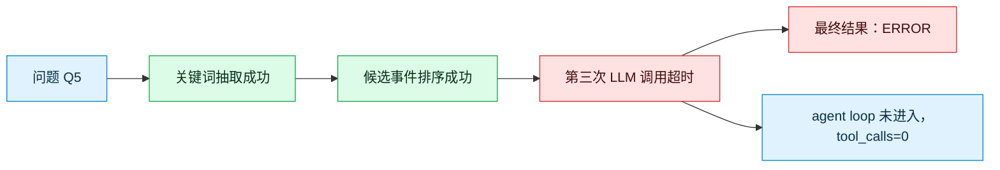
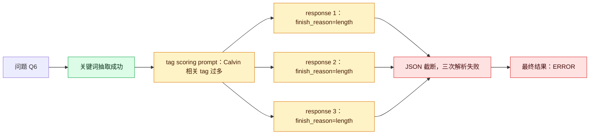

# MRAgent 核心验证实验报告（Raw Trace 更新版）

生成日期：2026-07-09  
基于远端提交：`c85488efdfd9f6b4c3c55b6e4e3060a9c2797625`  
本报告分支额外修正：`build_mragent_traces.py` 与 `reports/mragent_100q_trace_manifest_20260709.jsonl` 中的 `evidence_hit` 写死为 0 的问题。

## 1. 本次更新验证了什么

上一版 `eb7ef28` 只有结果级 trace manifest，`raw_prompt_file` / `raw_response_file` 多数是占位说明，不能支持过程级 badcase 分析。

本次 `c85488e` 已经把占位文件替换为真实 raw API 数据，包含：

| 类型 | 覆盖 |
|---|---:|
| 总题数 | 100 |
| raw prompt | 100/100 |
| raw response | 100/100 |
| placeholder prompt | 0 |
| placeholder response | 0 |
| 有 request 序列的题 | 94/100 |
| retry/error log 非空 | 21/100 |

需要注意：当前 `tool_call_sequence` 能记录 request 序列，但 `function_name` 和 `arguments` 仍为空。因此它已经能审计 LLM 调用链、prompt、response、usage、finish reason 和错误，但还不能完全审计“工具函数名、工具参数、工具返回值”的每一步。

## 2. 核心实验结果是否改变

不改变。MRAgent 的核心改进仍然成立。

| 指标 | 结果 |
|---|---:|
| 题数 | 100 |
| 平均 F1 | 0.629 |
| 平均 evidence hit | 0.718 |
| ERROR | 2 |

按类别：

| 类别 | 含义 | 题数 | F1 | Evidence Hit | ERROR | F1 < 0.3 |
|---|---|---:|---:|---:|---:|---:|
| 1 | 多跳事实整合 | 20 | 0.554 | 0.483 | 1 | 8 |
| 2 | 时间推理 | 20 | 0.600 | 0.800 | 0 | 6 |
| 3 | 偏好/假设/开放推理 | 18 | 0.345 | 0.505 | 1 | 10 |
| 4 | 单跳事实 | 22 | 0.752 | 1.000 | 0 | 1 |
| 5 | 对抗/不可回答 | 20 | 0.850 | 0.750 | 0 | 3 |

解释：

1. single-hop 不是主要瓶颈。category 4 的 F1 为 0.752，evidence hit 为 1.000。
2. 最弱的是 category 3，说明偏好、假设、人物状态推断仍然困难。
3. category 2 的时间推理仍明显优于普通 RAG，但仍存在日期归一化和相对时间解释错误。
4. category 5 总体较好，但还有 3 个过度回答问题。

### 2.1 与其他 baseline 的对比

本报告必须和 baseline 一起看，否则只能说明 MRAgent 自身能跑通，不能说明“图记忆 + 主动检索”的改进是否 solid。

四组实验使用同一批 10 个 LoCoMo conversation sample、同一批 100 个问题、同一批 rewrite/embedding/graph cache：

| 方法 | 输入与检索方式 | 回答方式 |
|---|---|---|
| MRAgent | 图结构记忆 + 多步 LLM 检索/排序/推理 | agent 式多轮调用 |
| RAG | rewrite sentence 向量 Top-k | 单轮 plain-text QA |
| GraphRAG | 向量种子 + 局部图扩展 | 单轮 plain-text QA |
| Oracle | gold evidence 对应 context | 单轮 plain-text QA |

整体对比：

| 方法 | 题数 | ERROR | 平均 F1 | Evidence Hit |
|---|---:|---:|---:|---:|
| MRAgent | 100 | 2 | 0.629 | 0.709 |
| RAG | 100 | 0 | 0.430 | 0.612 |
| GraphRAG | 100 | 0 | 0.366 | 0.596 |
| Oracle | 100 | 0 | 0.408 | 0.990 |

说明：

1. F1 来自 `reports/core_validation_100q_per_question_compare_20260708.csv` 和修正后的 manifest。
2. Evidence Hit 使用原始 JSONL 的 `prediction_context` 与 gold evidence 做 prefix matching，排除 null-gold 无证据题。
3. Oracle 的 evidence hit 最高是预期结果，因为它直接使用 gold evidence；但 Oracle F1 仍低于 MRAgent，说明“给对证据”不等于“答对问题”。

按类别对比：

| 类别 | 含义 | MRAgent | RAG | GraphRAG | Oracle | 主要结论 |
|---|---|---:|---:|---:|---:|---|
| 1 | 多跳事实整合 | 0.554 | 0.417 | 0.292 | 0.476 | MRAgent 优于三个 baseline，但仍有较多 miss evidence |
| 2 | 时间推理 | 0.600 | 0.177 | 0.170 | 0.252 | MRAgent 优势最明显 |
| 3 | 偏好/假设/开放推理 | 0.345 | 0.088 | 0.065 | 0.099 | 全部方法都弱，但 MRAgent 仍明显更高 |
| 4 | 单跳事实 | 0.752 | 0.525 | 0.506 | 0.609 | single-hop 并不低，MRAgent 最好 |
| 5 | 对抗/不可回答 | 0.850 | 0.900 | 0.750 | 0.550 | RAG 略高，MRAgent 有过度回答风险 |

成对比较：

| 比较 | 题数 |
|---|---:|
| MRAgent F1 > RAG F1 | 38 |
| RAG F1 > MRAgent F1 | 16 |
| MRAgent 与 RAG 打平 | 46 |
| MRAgent F1 > GraphRAG F1 | 49 |
| GraphRAG F1 > MRAgent F1 | 10 |
| MRAgent 近似正确而 RAG 基本错误 | 16 |
| RAG 近似正确而 MRAgent 基本错误 | 2 |

这里的关键不是 MRAgent 是否每题都赢，而是赢的题型是否符合论文机制预期。当前结果符合：

1. 时间推理显著提升：RAG/Oracle 常停留在 `yesterday`、`last week`，MRAgent 更常归一化到具体日期。
2. 单跳定位更稳：MRAgent category 4 F1 最高，说明图记忆不是只对复杂问题有效，对简单事实定位也有收益。
3. 开放推理仍弱但相对更好：category 3 全部方法低，MRAgent 仍比 RAG / GraphRAG / Oracle 高。
4. 对抗题不是 MRAgent 优势：category 5 中 RAG 略高，说明图检索越积极，越需要拒答/反证机制。

### 2.2 为什么这些结果能支持“核心改进 solid”

当前实验能够支持 MRAgent 核心改进，理由有三层。

第一，和普通 RAG 相比，MRAgent 不是只提高 evidence hit，而是提高了答案质量。RAG 在一些题中也检索到了 gold evidence，但仍输出相对时间或错误实体。例如：

| sample | question | gold | MRAgent | RAG | 说明 |
|---|---|---|---|---|---|
| conv-26 | When did Caroline go to the LGBTQ support group? | 7 May 2023 | 7 May 2023 | Yesterday | MRAgent 利用时间锚点完成归一化 |
| conv-41 | What is the name of Maria's second puppy? | Shadow | Shadow | Coco | MRAgent 更好地处理实体顺序关系 |
| conv-50 | When did Dave see Aerosmith perform live? | weekend before March 26, 2023 | weekend before 26 March 2023 | Last weekend | MRAgent 保留了会话日期上下文 |

第二，和 GraphRAG 相比，MRAgent 的优势说明“简单图扩展 + 单轮回答”不够。GraphRAG 的 context 可能更大，但如果没有主动选择、排序、反思和时间/实体约束，仍会把相邻但错误的证据混进答案。

第三，和 Oracle 相比，MRAgent 的优势说明“gold evidence 直接喂给模型”也不足以解决 long conversation QA。Oracle evidence hit 接近 1.0，但 F1 只有 0.408，典型原因是：

1. gold evidence 是相对时间，需要 session date 才能回答。
2. gold evidence 只是一条短句，需要邻近上下文。
3. category 3/5 需要前提判断，而不是抽取式回答。

因此，本轮更强的结论是：MRAgent 的核心收益来自“图结构记忆 + 主动检索/排序/上下文重建”的组合，而不是单独来自 embedding recall 或 gold evidence recall。

## 3. Raw trace 对两个 ERROR 的解释

### ERROR 1：conv-50 Q5

| 字段 | 内容 |
|---|---|
| question | Would Dave prefer working on a Dodge Charger or a Subaru Forester? |
| gold | Dodge Charger |
| error_type | `api_timeout` |
| trace | `result/diagnostics/mragent_100q_traces/conv-50/q005_trace.json` |
| raw prompt | `result/diagnostics/mragent_100q_traces/conv-50/q005_raw_prompts.jsonl` |
| raw response | `result/diagnostics/mragent_100q_traces/conv-50/q005_raw_responses.jsonl` |
| retry log | `result/diagnostics/mragent_100q_traces/conv-50/q005_retry_log.jsonl` |

实际过程：

1. 第 1 次 API 调用成功：关键词抽取，`finish_reason=stop`，`usage.total=530`。
2. 第 2 次 API 调用成功：事件排序，`finish_reason=stop`，`usage.total=3007`。
3. 第 3 次 API 调用超时：`APITimeoutError('Request timed out.')`。
4. `tool_calls=0`，说明没有进入 agent tool loop。

结论：这不是图检索策略失败，而是进入检索循环前的 LLM API timeout。它会拉低 MRAgent 结果，但不能作为 MRAgent 图结构机制失败的证据。

### ERROR 2：conv-50 Q6

| 字段 | 内容 |
|---|---|
| question | Who supports Calvin in tough times? |
| gold | friends and team |
| error_type | `json_parse_failure` |
| trace | `result/diagnostics/mragent_100q_traces/conv-50/q006_trace.json` |
| raw prompt | `result/diagnostics/mragent_100q_traces/conv-50/q006_raw_prompts.jsonl` |
| raw response | `result/diagnostics/mragent_100q_traces/conv-50/q006_raw_responses.jsonl` |
| retry log | `result/diagnostics/mragent_100q_traces/conv-50/q006_retry_log.jsonl` |

实际过程：

1. 第 1 次 API 调用成功：关键词抽取，`finish_reason=stop`，`usage.total=384`。
2. 后续 3 次 tag scoring 调用都返回 `finish_reason=length`。
3. 每次 completion 都打满 `8192` tokens。
4. 输出是超长 `tag_scores` JSON，被截断后无法解析。
5. `chat_text` 三次 JSON parse attempt 全部失败。
6. `tool_calls=0`，同样没有进入 agent tool loop。

结论：这是结构化输出设计失败，不是检索图本身失败。触发原因是 tag 数过多、prompt 要求对每个 tag 打分，模型输出无限扩张，最终被 `max_tokens=8192` 截断。

## 4. MRAgent Badcase 分类

基于修正后的 manifest：

| 类型 | 数量 | 主要含义 |
|---|---:|---|
| F1 < 0.3 | 28 | 包括真实错误、答案表达不一致、评估惩罚 |
| evidence hit 但 F1 < 0.8 | 26 | 检索到证据但回答生成、归一化或评估失败 |
| miss gold evidence | 22 | 检索路径未覆盖 gold evidence |
| cat5 过度回答 | 3 | 不可回答问题被相关记忆诱导 |
| temporal low | 11 | 时间归一化或相对时间解释不稳定 |
| single-hop low | 1 | 主要是答案过长导致 F1 被稀释 |
| cat3 low | 10 | 偏好/假设/开放推理是当前主弱项 |

### 4.1 Evidence Hit 但答案错

这类 badcase 说明“图检索到了证据”，但生成环节仍失败。典型例子：

| sample | question | gold | prediction | 问题 |
|---|---|---|---|---|
| conv-26 Q6 | How long has Melanie been practicing art? | Since 2016 | Seven years | 语义接近但 F1 为 0，需要 judge |
| conv-30 Q7 | How does Gina describe the feeling that dance brings? | magical | 长句中包含 magical | 答案过长，F1 被稀释 |
| conv-42 Q6 | How many times has Nate taken his turtles on a walk? | Twice | 2 | 表达等价但 token F1 为 0 |
| conv-50 Q2 | Does Dave's shop employ a lot of people? | Yes | No | 证据解释错误，是真 badcase |

结论：这一组不能简单当成“模型错了”。需要分成三类：

1. 评估误伤：`Twice` vs `2`、`Since 2016` vs `Seven years`。
2. 答案过长：包含 gold 但 F1 低。
3. 真实生成错误：证据在 context 中，但模型解释反了。

### 4.2 Miss Gold Evidence

`miss_gold_evidence=22` 是当前最值得优化检索策略的部分。这类题才真正指向图检索路径问题。

典型例子：

| sample | question | gold | prediction | 判断 |
|---|---|---|---|---|
| conv-30 Q1 | What do Jon and Gina both have in common? | They lost their jobs and started businesses | They both love dance and use it for stress relief | 多跳共同点检索偏到表层兴趣 |
| conv-41 Q3 | When did John take a road trip to the Pacific Northwest? | 2022 | no information available | 时间事件未命中 |
| conv-48 Q6 | When did Deborah go to an art show with Anna? | 9 April 2023 | no information available | 时间事件未命中 |

这组是后续 CBR/Q-learning 最适合优化的对象：让系统学习哪些问题需要沿时间、人物、事件三类边扩展，而不是只看局部相似度。

### 4.3 Cat5 过度回答

当前 3 个明显过度回答：

| sample | question | prediction | gold |
|---|---|---|---|
| conv-30 Q9 | What did Jon want his customers to feel in her store? | cozy and comfortable | None |
| conv-41 Q9 | What important values does Maria want to teach her kids through adopting a rescue dog? | Responsibility and compassion | None |
| conv-42 Q9 | What did Nate think of the caramel ice cream he made? | Super good, rich and creamy | None |

共同模式：问题中存在错误实体、错误前提或未提及前提，MRAgent 找到了相关记忆后直接作答，没有做足“实体一致性/前提成立性”检查。

后续改造点：

1. 在最终回答前增加“反证检查”。
2. 对 category 5 或低置信问题，要求模型列出 subject 是否一致。
3. 若 evidence 只支持相邻实体，不支持问题实体，应输出 Not mentioned。

## 5. 对 MRAgent 核心改进的重新判断

Raw trace 让结论更清楚：

1. MRAgent 的有效收益主要来自图检索和上下文重建，而不是简单 evidence recall。
2. 两个 ERROR 都发生在进入 agent loop 前，不应被解释成图遍历策略失败。
3. single-hop 低分问题基本解除，100q 中只有 1 个 single-hop F1 < 0.3。
4. 当前主要瓶颈是 category 3 推理、miss gold evidence 的检索路径、以及 cat5 过度回答。
5. `finish_reason=length` 已经是明确工程问题：某些 JSON scoring prompt 不受控，会让输出无限扩张。

## 6. 当前简化与改进

当前实验相比论文原始设置有以下简化：

1. 使用 DeepSeek-V4-Flash / SiliconFlow，不是论文原始模型。
2. `ENABLE_THINKING=0`，关闭思考输出，避免 token 爆炸。
3. 只跑 LoCoMo 10 个 sample、100 题，不是全量 benchmark。
4. RAG / GraphRAG / Oracle 是工程版 baseline，不是外部完整 baseline。
5. 图构建已缓存，不在本次 raw trace 审计中重跑。
6. 当前 trace 记录了 LLM request/response，但工具函数名和参数仍未完整保留。

已经完成的工程改进：

1. raw prompt / raw response 覆盖 100/100。
2. 可以定位每次 API 的 `request_id`、`finish_reason`、`usage` 和原始 JSON 内容。
3. 可以区分 timeout、JSON 截断、普通低 F1、miss evidence。
4. 修复 manifest 中 `evidence_hit` 写死为 0 的问题。
5. 修复错误匹配不按 sample 限定的问题，避免把不同 sample 的错误串到当前题。

## 7. 下一步实验重点

优先级最高的不是继续扩大样本，而是先修两个明确工程问题：

1. **限制 tag scoring 输出**
   - 限制 tag 数，例如 top 30。
   - 要求只输出分数大于阈值的 tag。
   - 降低该阶段 max tokens。
   - 或改成分批 scoring 后合并。

2. **保留真实工具调用参数**
   - 当前 raw trace 看到的是 API request/response。
   - 还需要在 agent tool dispatcher 处记录 `tool_name`、`arguments`、`return_nodes`、`return_text`。

3. **对 cat5 增加前提检查**
   - 最终回答前检查实体是否一致。
   - 若问题前提未被证据支持，输出 Not mentioned。

4. **对 miss evidence 做 CBR/Q-learning 改造**
   - 把 22 个 miss gold evidence badcase 作为第一批训练/案例库。
   - 记录问题类型、错误检索路径、正确 gold evidence 类型。
   - 在检索前选择策略：时间扩展、人物扩展、事件扩展、反证检查。

## 8. 总体结论

本轮 raw trace 推送显著提高了实验可审计性。现在可以确认：

1. MRAgent 100q 结果不是偶然样例，核心收益仍然成立。
2. 两个 ERROR 都不是图检索机制失败，而是 API timeout 和 JSON 截断。
3. single-hop 不是当前主要问题。
4. 下一阶段最值得做的是 CBR/Q-learning 检索策略优化、cat5 拒答机制、tag scoring 输出约束。

如果后续要把本实验写成更强的研究论证，必须继续补齐工具层 trace，即每一步工具的名称、参数、返回节点和返回文本。目前 raw API trace 已经足够定位 LLM 调用问题，但还不足以完全解释图遍历策略的每一步选择。

## 9. 2026-07-14 协议校正与 500 题扩展

本报告与原有 100 题表格完整保留，并统一标记为 `pre-protocol diagnostic`；没有删除任何旧结果。后续代码与 trace 审计发现以下可比性问题，因此不能继续把旧数值当作论文主表级证据：

1. MRAgent raw prompt 记录其 QA/tool 模型为 `deepseek-ai/DeepSeek-V4-Flash`，而 RAG/GraphRAG/Oracle runner 在 `--model deepseek` 下默认使用 `deepseek-ai/DeepSeek-V4-Pro`。后续每种方法均须显式传入同一个 `--qa_model`。
2. 旧 RAG/GraphRAG/Oracle context builder 丢弃了 `event_time/conversation_time`。在旧 RAG 结果中，多个 temporal 题已经命中 evidence，却仍返回 `Yesterday` 或 `Last week`；这是 baseline runner 删除时间锚点造成的，不能解释为被动检索必然无法使用证据。
3. 旧 MRAgent 只限制总工具数 50，没有实现论文的每轮 10 次工具调用上限。后续协议使用 `8 rounds x 10 calls`。
4. 旧 100 题 manifest 包含 cat5，而论文 LoCoMo 主比较排除了 adversarial questions。

新的主实验协议见 `docs/locomo_500q_ablation_protocol.md`：先运行固定 cat1-4 的 100 题修复后 pilot，再运行固定 cat1-4 的 500 题 LoCoMo-10 主实验。新的比较包括 full MRAgent、实现级组件消融、含时间元数据的 native raw-turn RAG、修正后的 GraphRAG 和 Oracle。历史 all-category 结果继续用于 trace 与鲁棒性分析，但不再直接与论文 Table 1 的数值对齐。
