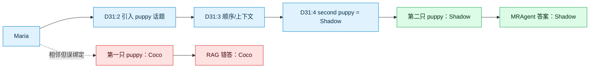
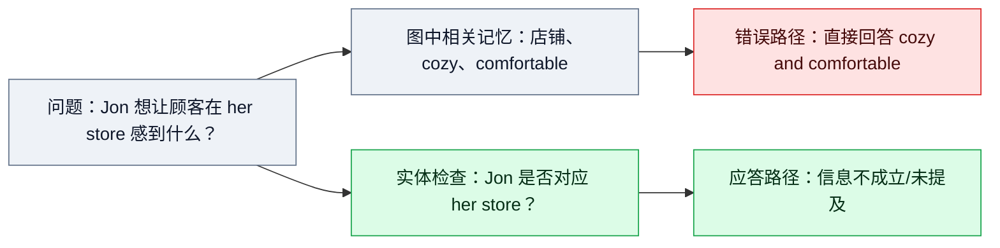
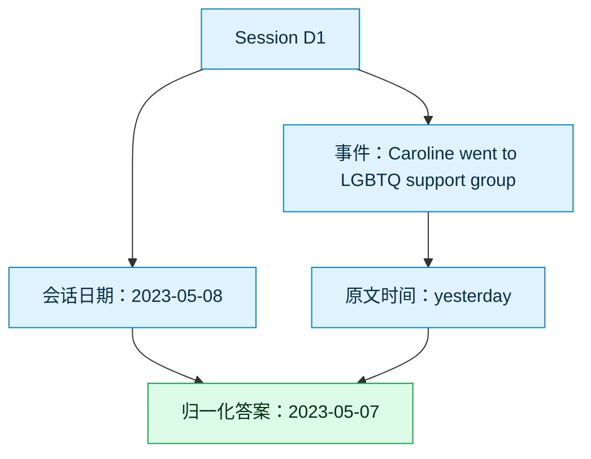
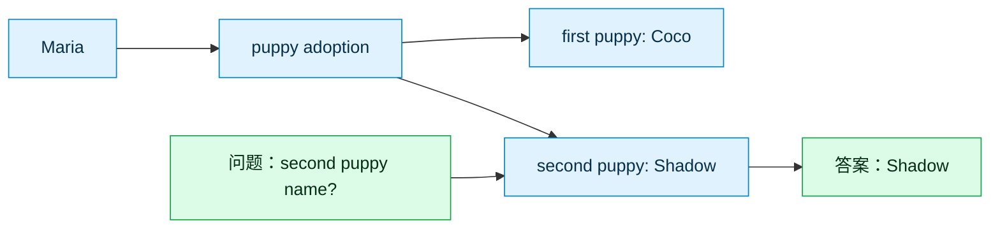
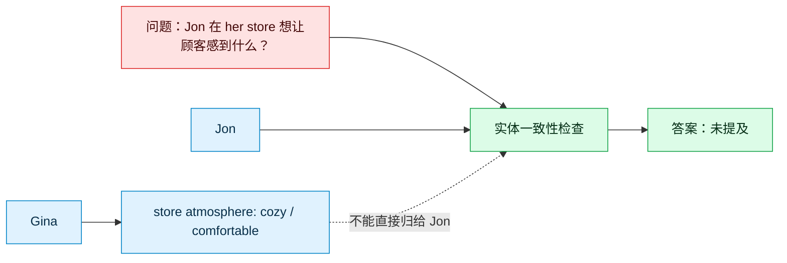

# MRAgent 核心验证实验报告

生成日期：2026-07-09  
基线提交：`829771513a8f2e60eded76f914255bf8fc728ad2`  
结果来源：`result/locomo/*_100q.jsonl`、`reports/core_validation_100q_per_question_compare_20260708.csv`

## 1. 这次实验要验证什么

本轮目标不是完整复现论文全量 benchmark，而是验证 MRAgent 的核心机制是否有真实收益：

1. 图结构记忆是否优于普通向量 Top-k RAG。
2. 由智能体通过工具调用在图上检索、跳转、整合，是否优于一次性 GraphRAG 拼接。
3. 之前 small-scale 实验中 single-hop 分数偏低，究竟是机制问题、图构建问题，还是评估/小样本问题。
4. 当前 badcase 是检索失败、图构建失败、答案生成失败，还是评估口径失败。

实验使用 LoCoMo 的 10 个 conversation sample，每个 sample 抽取 10 个问题，共 100 题。四种方法全部生成了 raw JSONL：

| 方法 | 文件后缀 | 含义 |
|---|---|---|
| MRAgent | `graphbuild_100q` | 使用图记忆和工具调用进行多轮检索与回答 |
| RAG | `rag_plain_100q` | 对 rewrite sentence 做向量 Top-k，再单轮回答 |
| GraphRAG | `graphrag_plain_100q` | 先取检索种子，再做局部图扩展，最后单轮回答 |
| Oracle | `oracle_plain_100q` | 直接把 gold evidence 对应 rewrite context 给模型回答 |

注意：仓库中已有 `reports/core_validation_100q_20260708.md` 仍保留旧 Oracle 结果，显示 Oracle 有 77 个 ERROR。最新推送已经包含 `oracle_plain_100q`，Oracle 实际不再是 77 个 ERROR。因此本报告以 40 个最新 JSONL 和 100 行 CSV 为准。

## 2. 核心结果

下表的 F1 来自 `core_validation_100q_per_question_compare_20260708.csv` 的 per-question 平均；evidence hit 由原始 JSONL 的 `prediction_context` 和 gold evidence 重新计算，并采用 turn-level / sentence-level 前缀匹配，例如 `D1:25` 可以匹配 `D1:25-1`。

| 方法 | 题数 | ERROR | 平均 F1 | Evidence Hit |
|---|---:|---:|---:|---:|
| MRAgent | 100 | 2 | 0.629 | 0.709 |
| RAG | 100 | 0 | 0.430 | 0.612 |
| GraphRAG | 100 | 0 | 0.366 | 0.596 |
| Oracle | 100 | 0 | 0.408 | 0.990 |

按类别拆分：

| 类别 | 问题类型 | 题数 | MRAgent F1 | RAG F1 | GraphRAG F1 | Oracle F1 |
|---|---|---:|---:|---:|---:|---:|
| 1 | 多跳事实整合 | 20 | 0.555 | 0.417 | 0.292 | 0.476 |
| 2 | 时间推理 | 20 | 0.600 | 0.177 | 0.170 | 0.252 |
| 3 | 偏好/假设/开放推理 | 18 | 0.345 | 0.088 | 0.065 | 0.099 |
| 4 | 单跳事实 | 22 | 0.752 | 0.525 | 0.506 | 0.609 |
| 5 | 对抗/不可回答 | 20 | 0.850 | 0.900 | 0.750 | 0.550 |

成对比较：

| 比较 | 题数 |
|---|---:|
| MRAgent F1 > RAG F1 | 38 |
| RAG F1 > MRAgent F1 | 16 |
| MRAgent 与 RAG 打平 | 46 |
| MRAgent F1 > GraphRAG F1 | 49 |
| GraphRAG F1 > MRAgent F1 | 10 |
| MRAgent 近似正确而 RAG 基本错误 | 16 |
| RAG 近似正确而 MRAgent 基本错误 | 2 |

## 3. 核心结论是否 solid

当前证据支持“核心改进有效”，但还不能称为完整论文复现。

支持点：

1. MRAgent 总体 F1 明显高于 RAG 和 GraphRAG，100 题上分别约高 0.199 和 0.263。
2. 时间推理是最清晰收益点：category 2 中 MRAgent 为 0.600，RAG/GraphRAG 只有 0.177/0.170。
3. MRAgent 在 single-hop 上也表现强，category 4 达到 0.752，并且 evidence hit 为 1.000。
4. Oracle evidence hit 接近 1.0，但 F1 只有 0.408，说明“拿到证据”不等于“能答对”。MRAgent 的优势不只是 evidence recall，而是通过图工具路径保留了会话时间、人物关系和局部上下文。

限制点：

1. 只有 LoCoMo 的 10 个 sample、100 题，不是全量 benchmark。
2. 使用 SiliconFlow DeepSeek/Qwen 系列替代原论文模型，模型条件不同。
3. 当前推送没有完整 tool trace/raw prompt/raw API response，因此 badcase 的工具调用过程只能从 `prediction_context`、输出和指标重建。
4. category 5 中 RAG 略高于 MRAgent，说明 MRAgent 在对抗/不可回答问题上有过度回答风险。
5. GraphRAG baseline 是工程简化版，不一定等价于外部成熟 GraphRAG 系统。

因此当前更准确的结论是：MRAgent 的图记忆 + 工具检索机制在 100 题核心验证集上已经表现出稳定收益，尤其是时间推理、单跳定位和实体关系消歧；下一步需要扩大样本、保留完整 trace，并加入更严格的 judge/eval。

## 4. 为什么之前 single-hop 低

之前 single-hop 低主要不是图构建失败。100 题结果显示：

| 指标 | 结果 |
|---|---:|
| category 4 single-hop 题数 | 22 |
| MRAgent category 4 F1 | 0.752 |
| MRAgent category 4 evidence hit | 1.000 |
| MRAgent single-hop F1 < 0.3 的题数 | 1 |

唯一明显低分样例：

| 字段 | 内容 |
|---|---|
| sample | `conv-30` |
| question | How does Gina describe the feeling that dance brings? |
| gold | magical |
| MRAgent prediction | It's like air; all her worries vanish; freedom; joy and thrill; magical; ain't nothing like the feeling it gives us |
| MRAgent context | `D11:8; D11:6; D5:15; D15:8; D5:17` |
| MRAgent F1 | 0.105 |

这个样例中 MRAgent 已经包含 gold 关键词 `magical`，但回答太长，token-level F1 被稀释。它更像评估口径问题，而不是图检索失败。

所以之前 single-hop 偏低的主要原因是：

1. 小样本波动：早期只看少量题，单个 badcase 会明显拉低均值。
2. exact/token F1 对长答案不友好：模型答出正确词但附加解释，会被扣分。
3. 部分 Oracle/RAG baseline 旧版 JSON 解析失败，使对比表容易误导。
4. single-hop 不代表“只检索一个句子就能答”，很多题仍需要正确绑定人物、时间和上下文。

## 5. Badcase 过程分析

当前 GitHub 结果没有完整工具调用轨迹，因此下面的“过程”是从四组结果、检索上下文和 gold evidence 重建的。若要做审稿级分析，需要服务器继续上传每题 raw prompt、tool call trace、raw response 和 retry 日志。

### 5.1 时间推理：MRAgent 的典型成功

| 字段 | 内容 |
|---|---|
| sample | `conv-26` |
| question | When did Caroline go to the LGBTQ support group? |
| gold | 7 May 2023 |
| evidence | `D1:3` |
| MRAgent | 7 May 2023 |
| RAG | Yesterday |
| GraphRAG | Yesterday |
| Oracle | yesterday |

重建过程：

1. RAG、GraphRAG 和 Oracle 都能看到核心 evidence，但只输出了相对时间 `yesterday`。
2. MRAgent 沿图检索时保留了 session/date 上下文，把 `yesterday` 归一化成 `7 May 2023`。
3. 这说明 MRAgent 的收益不只是找到证据，而是把 evidence 放回可推理的图上下文。

### 5.2 实体关系消歧：MRAgent 的典型成功

| 字段 | 内容 |
|---|---|
| sample | `conv-41` |
| question | What is the name of Maria's second puppy? |
| gold | Shadow |
| evidence | `D31:4` |
| MRAgent context | `D31:2; D31:3; D31:4; D30:1` |
| RAG context | `D31:12; D31:4; D2:9; D10:10; D30:2` |
| MRAgent | Shadow |
| RAG / GraphRAG | Coco |

重建过程：

1. RAG 检索到了 `D31:4`，但同时取到其他 puppy 相关句子，回答成 `Coco`。
2. MRAgent 检索路径包含 `D31:2 -> D31:3 -> D31:4`，更像按局部事件链做关系定位。
3. 这个样例说明图结构不是只提高召回，还能减少实体混淆。

### 5.3 对抗问题：MRAgent 的过度回答风险

| 字段 | 内容 |
|---|---|
| sample | `conv-30` |
| question | What did Jon want his customers to feel in her store? |
| gold | null |
| MRAgent | cozy and comfortable |
| RAG | Not mentioned in the conversation |
| Oracle | no information available |

重建过程：

1. 问题中混入了错误实体或性别线索：`Jon` 和 `her store`。
2. MRAgent 找到了店铺氛围相关内容，但没有严格检查该内容是否属于 Jon。
3. RAG 反而因为保守回答，在 null-gold 问题上得分更高。

这说明 MRAgent 需要增加“实体一致性检查”和“不可回答判定”。

### 5.4 Oracle 失败：证据命中不等于答案正确

例子：

| 字段 | 内容 |
|---|---|
| sample | `conv-50` |
| question | When did Dave see Aerosmith perform live? |
| gold | on the weekend before March 26, 2023 |
| evidence | `D2:10` |
| MRAgent | the weekend before 26 March 2023 |
| RAG / GraphRAG | Last weekend |
| Oracle | no information available |

Oracle 已经拿到 gold evidence，但仍答错。可能原因：

1. gold evidence 对应 rewrite 句子只有相对时间，缺少 session 日期。
2. Oracle prompt 只给 evidence，不给邻近句和会话时间。
3. DeepSeek 在单句 QA 中偏向保守输出 `no information available`。

这类问题说明后续不能只看 evidence hit，还要看“证据是否足以回答”和“答案生成 prompt 是否保留时间锚点”。

## 6. 当前工程简化与改进

本轮为了快速验证核心机制，做了以下简化和工程修复：

1. 模型替换：使用 SiliconFlow 的 DeepSeek/Qwen 系列，不是论文原始模型。
2. 关闭思考模式：`ENABLE_THINKING=0`，避免 rewrite 阶段 completion token 爆炸和 API 挂死。
3. 图构建加冷却：`API_CALL_COOLDOWN_SECONDS=60`，降低连续大请求被限流的概率。
4. 强制暴露 timeout：`API_CLIENT_MAX_RETRIES=0`，避免 SDK 内部重试导致进程假死。
5. 增加 raw API 日志：可以记录 started/success/error，但当前 GitHub 仍没有上传完整 raw prompt/response。
6. baseline QA 改成 plain text：RAG、GraphRAG、Oracle 不再强制 JSON schema，避免自然语言答案被 JSON 解析失败误判为 ERROR。
7. 只做 10 sample / 100q 中型验证：先验证主机制，再决定是否扩展到 full LoCoMo。
8. GraphRAG 是简化 baseline：当前是局部图扩展 + 单轮回答，不等价于完整外部 GraphRAG 框架。
9. 尚未加入 CBR/Q-learning：当前报告只验证原始 MRAgent 图记忆机制，CBR/Q-learning 是下一阶段改造。
10. VLM 尚未作为主路径：若 rewrite/graph construction 中存在图片语义，后续需要加入 Qwen VLM 图片描述工具。

## 7. Memory 样例图

### 样例 A：时间锚点记忆

### 样例 B：人物-实体-顺序关系记忆

### 样例 C：不可回答问题需要反证记忆

## 8. 下一步建议

优先级按“验证核心改进是否 solid”排序：

1. 上传完整 trace：每题 raw prompt、tool call sequence、tool output、raw API response、retry/timeout 日志。没有这些，badcase 只能做结果级重建。
2. 对 100q 做 LLM judge：重点复核 `F1=0 但语义可能正确` 的题，例如 `Since 2016` vs `Seven years`。
3. 增加 entity consistency check：专门针对 category 5，避免图检索到相关但实体不一致的证据后过度回答。
4. 修正 Oracle prompt：给 gold evidence 时同时附带 session date、neighbor evidence 和 rewrite origin，验证“Oracle 低分”是否主要是 prompt/context 问题。
5. 扩展到 200-300q：优先增加 category 2/3/5，因为它们最能区分机制收益和失败风险。
6. 加入 VLM rewrite ablation：对含图片的 session，用 Qwen VLM 先生成图片描述，再进入 rewrite/graph construction。
7. 在当前稳定 baseline 上加入 CBR/Q-learning：不要先改全 pipeline，先把 CBR 作为可插拔模块接到图检索前后的策略选择与反思更新环节。

## 9. 给当前阶段的判断

MRAgent 的核心改进目前是有价值的，尤其体现在：

1. 时间表达归一化。
2. 人物/实体关系消歧。
3. 单跳事实的稳定定位。
4. 需要多轮工具检索的问题。

当前最大问题不是“图没有用”，而是：

1. 对抗问题上容易过度回答。
2. category 3 的偏好/假设推理仍弱。
3. Oracle 和 baseline prompt 还不够公平，需要进一步修正。
4. 缺少完整 trace，导致 badcase 只能做到结果级分析。

因此下一阶段应该围绕“让图检索更会拒答、更会选择证据、更会记录失败经验”做 CBR/Q-learning 改造，而不是继续只扩大普通 RAG 对比。
