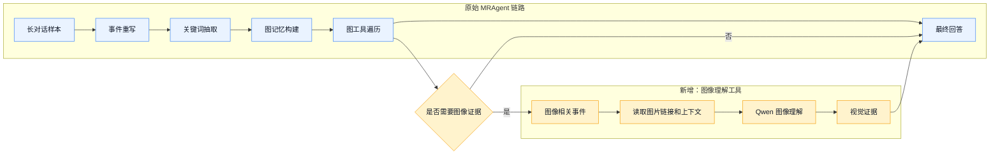
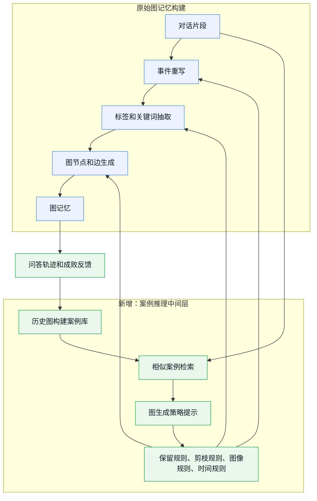
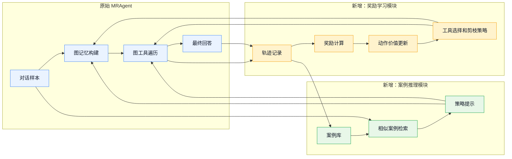

# MRAgent 阶段实验报告与 CBR/Q-learning 改造设计

日期：2026-07-02

本文档记录当前 MRAgent 复现实验的已完成结果、下一阶段 VLM 工具验证计划，以及将 Memento 中 CBR/Q-learning 思路迁移到图结构长对话记忆系统的设计。本文档区分两类内容：

- 已完成实验事实：已经有结果文件、日志或指标支撑。
- 研究设计设想：尚未实现或尚未验证，只作为后续改造路线。

本阶段不做训练集、验证集、测试集划分。当前仍处在机制诊断和工程复跑阶段，后续正式比较 CBR/Q-learning 效果时再按 conversation sample 做严格划分。

## 1. 当前已完成的实验结果

### 1.1 已完成范围

当前 GitHub 仓库中已完成并合并的是一次 LoCoMo 单样本 clean run：

- 样本：`conv-30`
- 问题数：15 题，按类别分层抽样
- 模型：DeepSeek-V4-Pro，通过 SiliconFlow OpenAI-compatible 接口调用
- 嵌入模型：Qwen/Qwen3-Embedding-8B
- Judge：Qwen/Qwen3-8B
- 主要报告：`reports/stage_b_clean_conv30_20260702.md`

这不是完整论文复现。它证明的是：当前工程链路可以在一个 LoCoMo 样本上完成图记忆构建、工具调用式问答、指标统计和中间产物审计。

### 1.2 图记忆构建结果

| 项目 | 结果 |
| --- | --- |
| rewrite sessions | 19/19 |
| NULL sessions | 0 |
| rewritten sentences | 1094 |
| keyword aligned sentences | 1094 |
| keyword instances | 4408 |
| unique keywords | 1779 |
| topics | 213 |
| personal events | 344 |
| unique tags | 465 |
| unique persons | 4 |
| episode events | 1094 |

结论：`conv-30` 的 conversation sample 已经完成图构建。当前尚未为全部 10 个 LoCoMo conversation samples 完成图构建。

### 1.3 QA 结果

| 指标 | 结果 |
| --- | --- |
| QA questions | 15 |
| errors | 0 |
| overall F1 | 0.5118 |
| category 1 multi-hop F1 | 0.2665 |
| category 2 temporal F1 | 0.7857 |
| category 4 single-hop F1 | 0.1170 |
| category 5 adversarial | 1.0000 |
| LLM judge non-adversarial | 9/12 = 0.75 |
| tool calls per question | avg 9.5, min 3, max 31 |
| schema retries | 0 |
| forced accepts | 0 |
| pipeline wall-clock | about 3h13m |
| QA per-question runtime sum | 6661.78s |

当前最清楚的结论：

1. 图构建链路已经跑通。
2. temporal 类问题表现最好。
3. multi-hop 和 image-related 问题是主要问题来源。
4. 当前结果仍然是单样本、小规模诊断，不能代表论文完整结果。

### 1.4 典型 badcase

| 问题 | 类别 | Gold | Prediction | 初步判断 |
| --- | --- | --- | --- | --- |
| Q1 | multi-hop | They lost their jobs and decided to start their own businesses | no information available | 已检索到多条相关证据，但没有完成跨证据综合 |
| Q7 | multi-hop / temporal | six months | 5 months | 检索到关键证据，但时间跨度计算错误 |
| Q9 | image-related | They are performing at the festival | no information available | 问题依赖图像语义，当前 DeepSeek 文本模型无法直接看原图 |

Q9 是下一阶段引入 VLM 工具的直接动机。数据中存在 `img_url` 和 `blip_caption`，但只依靠 caption 和文本图遍历不足以稳定回答图像相关问题。

## 2. 当前 token 问题状态

已完成 clean run 使用的是 `max_tokens=16384`。诊断日志显示：

- rewrite 和 keyword 阶段在 16384 配置下没有 NULL session。
- QA 阶段也使用了 16384。
- 当前不再把 `QA_MAX_TOKENS=8192` 作为本阶段变量。

本阶段结论是：先稳定复现图构建与 QA 行为，再考虑压缩 token 成本。当前不需要补跑 `QA_MAX_TOKENS=8192`。

## 3. 下一阶段：先验证 VLM 工具

### 3.1 为什么必须先验证 VLM

DeepSeek-V4-Pro 当前按文本模型使用，不支持直接图像理解。LoCoMo 样本中包含图像字段，部分问题需要理解图片内容。如果不引入 VLM，图像相关问题只能依赖 `blip_caption`，这会造成两类问题：

1. caption 可能丢失关键视觉事实。
2. 图记忆系统无法在问答阶段主动查看原图。

因此，Qwen/Qwen3.5-397B-A17B 应该先作为“图像理解工具”接入，而不是立刻替换整个 QA 模型。

### 3.2 VLM 工具边界

工具名称建议：`query_visual_evidence`

输入：

```json
{
  "event_id": "D1:25",
  "question": "What are they doing in the photo?",
  "nearby_dialogue": "...",
  "blip_caption": "...",
  "image_url": "..."
}
```

输出：

```json
{
  "visual_answer": "They are performing at a festival.",
  "visible_entities": ["people", "stage", "festival"],
  "confidence": "high",
  "used_image": true,
  "failure_reason": null
}
```

记录要求：

- 每次 VLM 调用必须记录 question、event_id、image_url、caption、VLM 原始回答、解析后回答、模型、token、耗时。
- 如果图片 URL 失效，必须记录为 image_fetch_failed。
- 不允许把 VLM 回答静默混入最终答案，必须能在 trace 中看到 VLM 工具调用。

### 3.3 VLM 工具验收标准

先只做工具级验证，不扩大数据集：

| 验收项 | 合格标准 |
| --- | --- |
| API 连通 | Qwen/Qwen3.5-397B-A17B 能接受 text + image_url 输入 |
| 图像读取 | 至少 3 个真实 LoCoMo image_url 能返回视觉描述 |
| trace 可审计 | 原始请求、原始响应、解析结果、耗时均有记录 |
| QA 可调用 | Q9 这类 image-related 问题能触发 `query_visual_evidence` |
| 不破坏 baseline | 不覆盖 clean run 文件，使用新 file tag，例如 `stratified_vlm` |

### 3.4 VLM 接入流程图



## 4. 50 题和 100 题扩展实验的含义

这里的“50 题 / 100 题”不是验证集或测试集，而是探索性诊断集。

建议定义：

- 50 题：选择 5 个 conversation samples，每个样本抽 10 题。
- 100 题：选择 10 个 conversation samples，每个样本抽 10 题。

抽样目的：

1. 覆盖 temporal、multi-hop、single-hop、adversarial、image-related。
2. 观察 VLM 工具是否只改善 image-related，还是会影响其他问题。
3. 收集足够的失败轨迹，为后续 CBR case bank 和 Q-learning reward 设计提供样本。

预计耗时应分两种情况估算：

| 场景 | 50 题预计耗时 | 100 题预计耗时 | 说明 |
| --- | --- | --- | --- |
| 已有图记忆，只跑 QA | 约 1.5-2.5 小时 | 约 3-5 小时 | 基于 conv-30 QA 约 444s/q 的串行和并发混合表现估计 |
| 从零构建图记忆再 QA | 约 15 小时 | 约 30 小时 | 按 conv-30 全链路约 3h13m/sample 粗略估计 |
| 加入 VLM 工具 | 在 QA 基础上增加 | 在 QA 基础上增加 | 每个 image-related 问题可能增加 10-60s，取决于图片 URL 和 API 延迟 |

当前建议：先做 VLM 工具验收，再做 50 题探索性诊断；不要直接上 100 题。

## 5. CBR 作为中间流程的设想

### 5.1 核心想法

可以把 CBR 设计成图记忆系统的中间流程：先针对“图生成问题”建立案例库和策略先验，再接入真实 conversation sample。

这里的“预训练”不建议一开始理解为大模型参数微调，而应理解为：

- 收集历史图构建轨迹。
- 标注哪些 rewrite、tag、keyword、person fact、image metadata 对后续 QA 有用。
- 形成图构建案例库。
- 在处理新 conversation sample 前，检索相似案例，给图构建阶段提供策略提示。

这样做的好处是：CBR 不直接塞答案事实，而是影响图结构记忆如何生成、保留、剪枝和检索。

### 5.2 CBR 中间流程图



### 5.3 案例库建议字段

```json
{
  "case_id": "",
  "sample_id": "",
  "stage": "graph_generation|graph_retrieval|answering",
  "input_context_summary": "",
  "question_type": "temporal|multi-hop|single-hop|image-related|adversarial",
  "graph_actions": [
    "keep_image_url",
    "preserve_absolute_date",
    "split_person_fact",
    "merge_duplicate_topic"
  ],
  "retrieval_trace": [],
  "answer_result": "",
  "gold_answer": "",
  "reward": 1.0,
  "failure_type": "none|missing_visual|bad_time_math|multi_hop_synthesis|over_pruning",
  "lesson": ""
}
```

## 6. CBR 与 Q-learning 在本实验中的区别

### 6.1 区别表

| 维度 | CBR | Q-learning |
| --- | --- | --- |
| 中文解释 | 基于历史案例的相似经验复用 | 基于奖励的状态-动作价值学习 |
| 主要输入 | 历史成功/失败案例、问题类型、图轨迹 | 状态、动作、奖励、下一状态 |
| 主要输出 | 策略提示、相似轨迹、注意事项 | 动作价值、选择策略、剪枝/保留决策 |
| 是否必须训练参数 | 不一定，可以先非参数检索 | 是，至少需要价值表或可训练打分器 |
| 是否能立即接入 | 可以，先做案例库和检索 | 需要定义 reward 和更新规则后再接入 |
| 风险 | 检索到相似但无用的案例；提示污染 | reward 设计不当；样本少时学到错误策略 |
| 当前状态 | 设计中，未实现 | 设计中，未实现 |

### 6.2 CBR 在本实验中的具体设计

CBR 先作为可插拔模块接入，不改变 MRAgent 主流程：

1. 图生成前：检索相似图构建案例，提示 rewrite/keyword/tag/person/image metadata 的保留策略。
2. 图检索前：检索相似问答轨迹，提示优先使用哪些图工具。
3. 回答后：把成功/失败轨迹写回案例库。

关键约束：

- CBR 不能直接注入 gold answer。
- CBR 注入的是策略，不是事实答案。
- 每次 CBR 命中必须记录 case_id、相似度、注入内容、是否影响工具选择。

### 6.3 Q-learning 在本实验中的具体设计

Q-learning 不应只是“加一个 rerank 分数”。如果要声称使用 Q-learning，至少需要定义：

状态：

- 当前问题类型。
- 已命中的图节点、边、topic、person facts。
- 已调用工具序列。
- 是否已经获得时间证据、人物证据、视觉证据。

动作：

- 选择下一个图工具。
- 保留或剪枝某类节点。
- 是否调用 VLM 工具。
- 是否停止检索并生成答案。
- 是否回到图中继续扩展。

奖励：

- 最终答案正确：正奖励。
- 图像问题没有调用 VLM 且答错：负奖励。
- 检索过多无效节点：负奖励。
- 时间问题命中正确日期证据：中间正奖励。
- 输出 `no information available` 但证据已存在：负奖励。

更新：

- 初期可以离线记录 trajectory，再做离线 Q-value 估计。
- 在样本量不足前，不建议在线改写主流程。
- 如果没有 reward、下一状态和更新记录，就不能称为 Q-learning，只能称为启发式重排。

### 6.4 CBR/Q-learning 总体流程图



## 7. 后续实验路线

### Stage 0：已完成

目标：证明单样本 clean run 可审计。

状态：完成。

证据：

- `reports/stage_b_clean_conv30_20260702.md`
- `result/locomo/artifact_manifest_20260702_clean.json`
- `result/locomo/memory_audit_deepseek_stratified.json`
- `result/locomo/metrics_summary_deepseek_stratified.json`
- `result/diagnostics/api_call_log.jsonl`

### Stage 1：VLM 工具验证

目标：先验证 Qwen/Qwen3.5-397B-A17B 是否能作为图像理解工具稳定工作。

最小任务：

1. 从 `conv-30` 中选 3-5 个有 `img_url` 的事件。
2. 调用 VLM 读取原图。
3. 保存原始响应和解析结果。
4. 对 Q9 做一次带 VLM 工具的 QA。

成功标准：

- VLM 工具 trace 可审计。
- Q9 不再仅依赖 caption。
- 失败时能区分 API 失败、图片 URL 失败、模型理解失败、工具路由失败。

### Stage 2：50 题探索性诊断

目标：在不做正式验证集划分的情况下，扩大覆盖面。

建议：

- 选择 5 个 conversation samples。
- 每个样本 10 题。
- 优先包含 image-related、temporal、multi-hop。
- 使用 file tag：`explore50_vlm`。

产物：

- 每题 answer、gold、category、tool trace、VLM trace。
- 按失败类型汇总 badcase。
- 记录每个 sample 的图构建是否完整。

### Stage 3：CBR case bank

目标：把 Stage 0-2 的轨迹转为案例库。

产物：

- `result/case_bank/graph_cases_YYYYMMDD.jsonl`
- 每条 case 包含问题、轨迹、成功/失败、reward、lesson。

### Stage 4：CBR 图生成/检索改造

目标：先接入非参数 CBR，不训练参数。

对比：

- baseline：原始 MRAgent。
- CBR-generation：只影响图生成。
- CBR-retrieval：只影响图检索。
- CBR-both：同时影响图生成和图检索。

### Stage 5：Q-learning 策略学习

目标：在已有 case bank 和轨迹日志后，学习图工具选择、节点剪枝、VLM 调用的动作价值。

前置条件：

- 至少有 50-100 题可审计轨迹。
- 每题有明确 failure_type。
- reward 规则稳定。
- 工具调用和图节点选择可复现。

## 8. 当前判断

当前实验还有继续价值，但价值不在“已经证明 MRAgent 复现了论文全部结果”，而在于：

1. 已经确认图记忆构建链路可以跑通。
2. 已经定位到图像理解、跨证据综合、时间计算是当前主要问题。
3. VLM 工具是必要的下一步，因为部分 LoCoMo 问题确实依赖图像。
4. CBR 可以先作为图生成和图检索的中间策略模块，而不是直接替换原始 MRAgent。
5. Q-learning 需要等可审计轨迹和 reward 规则足够稳定后再实施，否则只能算启发式策略，不应声称是强化学习。

本阶段优先级：

1. 先验收 VLM 工具。
2. 再做 50 题探索性诊断。
3. 用诊断轨迹建立 CBR case bank。
4. 最后再接 Q-learning。
